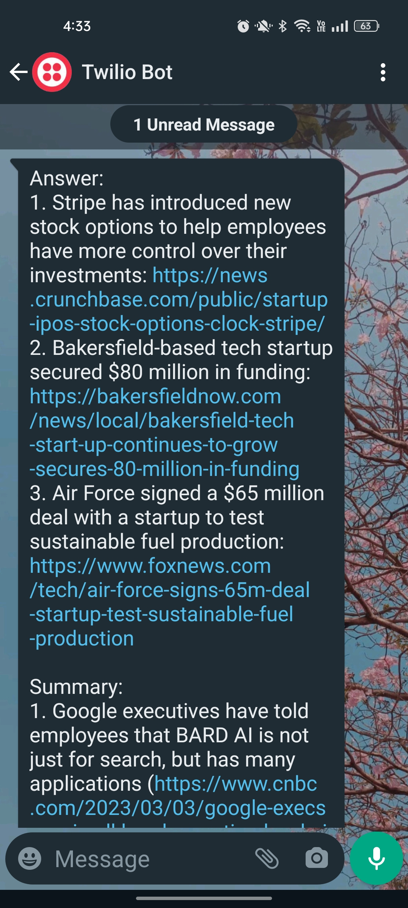

# GPT-3 Whatsapp Bot

This is a repository for a Whatsapp bot (Twilio) that uses GPT-3 for generating responses. It has been deployed using Azure Functions.

## Steps for Open AI API
1. I built accounts for Azure Functions and on Open AI to use their free initial services
2. I created a new Function App on Azure for this project
3. In workplace (in vscode resources), you'll find an option for `Add Function`
4. Select `HTTP response` and then `anonymous`
5. Use this Function and Copy the code in folder `Open AI API `to build your API
6. Install Azure terminal set up, you'll also have to do az-login to connect azure account
7. Deploy this function in terminal using "`func azure functionapp publish FUNCTION_APP_NAME --python --build local`". You can also select deploy in workplace option \

## Steps for Whatsapp Bot
1. Make a Twilio account and connect your number, you can use the free trial
2. Go to Console in top right, then sms and then whatsapp
3. You'll get the tutorials for number and key you want to connect
4. You can also find about API Keys and Tokes in Account in the top bar
5. Go to the Whatsapp Bot API code and add these credentials
6. You need to create another function Timer based instead of `HTTP response`
7. Paste the code in `__init__`
8. You can go to functions in it and set the frequency of output you desire
9. Deploy it
10. Sit back and relax \

Feel free to use and customize this bot for your own purposes. Don't forget to give credit if you do! \

** I will soon Upload and Link a youtube video with complete tutorials for this

